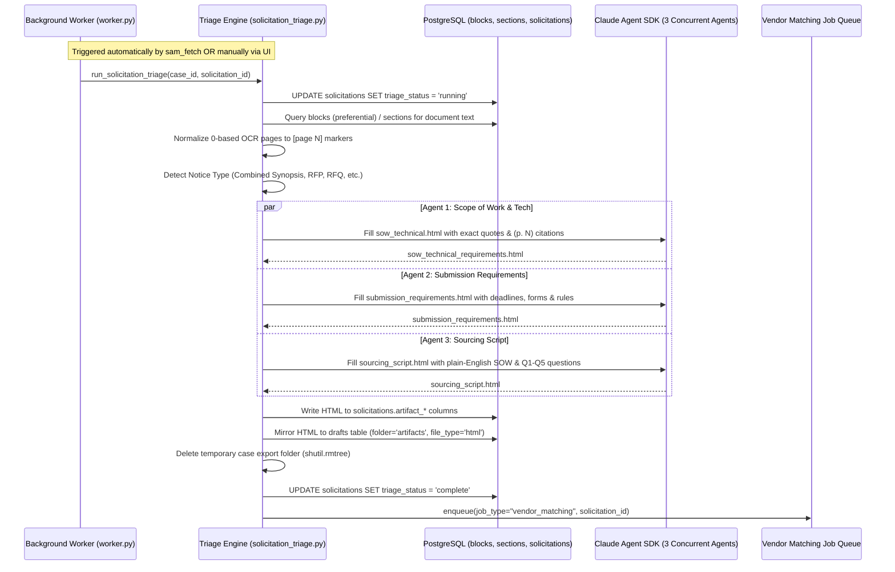

# Solicitation Triage — Automated Document Deconstruction & Sourcing Briefs

> **Purpose:** Onboard developers and AI agents to the federal solicitation triage and automated deconstruction engine.  
> **Last Updated:** 2026-09-02  
> **Status:** Active / In Production

---

## 1. Business Overview

### What This Domain Does
The triage engine acts as the **translation layer** between dense, complex 80+ page federal solicitations (loaded with FAR clauses, amendments, and bureaucratic boilerplate) and actionable commercial subcontracting. 

Instead of requiring human analysts or small subcontractors to parse raw government RFP packages, the triage system automatically reads the ingested solicitation documents, classifies the procurement type, and concurrently extracts **3 standardized, styled, partner-facing HTML artifacts**:
1. **Scope of Work & Technical Requirements** (`artifact_scope_of_work`) — Plain-English scope summary, place of performance, mandatory licensing, personnel/clearance requirements, and CLIN pricing schedule.
2. **Submission Requirements & Instructions** (`artifact_submission_checklist`) — Required standard forms (SF-1449, SF-33, SF-1442), submission deadline date/time/timezone, submission email/portal, and volume page limits.
3. **Sourcing Script** (`artifact_evaluation_criteria`) — The commercial briefing for non-technical sourcing specialists, detailing "What Is This In Plain English", target NAICS, who to contact, and **Q1–Q5 screening questions** to ask subcontractors during qualification.

### Key Business Rules & Pipeline Gates

| Gate / Event | Location | Condition | Behavior / Outcome |
| :--- | :--- | :--- | :--- |
| **Auto-Trigger Gate** | `worker.py: process_sam_fetch_job` | `has_missing_docs == False` | If all solicitation documents download successfully, `job_type="solicitation_triage"` is automatically enqueued. If documents are missing, auto-trigger is withheld to allow manual document attachment. |
| **Manual Trigger Gate** | `solicitations.py: trigger_triage_endpoint` | `sol.documents` is non-empty & `triage_status != 'running'` | Allows manual (or re-run) execution from the UI. Returns `400` if no docs are attached, `409` if already running. |
| **Notice Type Classification** | `solicitation_triage.py: _detect_notice_type` | Keyword detection over full text | Classifies into: `combined_synopsis_solicitation`, `sources_sought`, `rfp`, `rfq`, `rfi`, `presolicitation`, or default `solicitation`. Adjusts extractor prompts accordingly. |
| **Quick-Kill Check** | `solicitation_triage.py: _run_triage` | Restrictive vehicle (e.g. JWCC) or deadline < 5 days | Informational only. Artifacts are **always** extracted regardless of quick-kill status. |
| **Handoff Gate** | `solicitation_triage.py: run_solicitation_triage` | Triage completes successfully | Automatically enqueues `job_type="vendor_matching"` to immediately transition into subcontractor matching. |

---

## 2. Pipeline Architecture & Execution Flow



### Detailed Lifecycle Steps

#### Step 1: Document Export & [page N] Citation Normalization
* Document text is retrieved from PostgreSQL. `blocks` (carrying OCR 0-based page numbers from DataLab) are converted to 1-based display numbers and output as `[page N]` markers.
* Text is exported to a temporary working directory: `backend/test_triage/case_{case_id}/`.
* Document text is analyzed against keyword precedence to identify the exact `notice_type`.

#### Step 2: Concurrent Multi-Agent Inspection & Extraction
* The orchestrator provides 3 pre-built HTML templates from `backend/test_triage/templates/`:
  - `sow_technical.html`
  - `submission_requirements.html`
  - `sourcing_script.html`
* 3 specialized Claude Agent SDK sub-agents are executed in parallel via `asyncio.gather`.
* **On-Demand Inspection Tools (No Memory Slurping):** Instead of dumping massive document strings into the initial prompt, each sub-agent is initialized with the case folder as its working directory and provided with 4 scoped tools:
  - `list_documents`: Lists all files with sizes and line counts.
  - `read_document(filename, start_line, max_lines)`: Reads specific page/line ranges on demand.
  - `search_documents(query)`: Greps across documents for clauses, CLINs, wage rates, or keywords.
  - `save_artifact(html)`: Saves the populated template.
* Each sub-agent inspects only the relevant documents for its specific artifact, replaces `[EXTRACT: ...]` placeholders, notes source page numbers `(p. N)`, and calls `save_artifact`.

#### Step 3: Dual Persistence (Solicitations + Workspace)
* The rendered HTML artifacts are saved directly to `solicitations` table columns:
  - `artifact_scope_of_work` $\leftarrow$ Scope of Work & Technical Requirements
  - `artifact_submission_checklist` $\leftarrow$ Submission Requirements & Instructions
  - `artifact_evaluation_criteria` $\leftarrow$ Sourcing Script
* Each artifact is simultaneously mirrored into the case workspace (`drafts` table, `folder='artifacts'`, `file_type='html'`), ensuring it is versioned, browsable in the File Explorer, and printable.
* The temporary work directory is deleted.
* `triage_status` updates to `'complete'` (or flags `has_partial_artifacts = true` if an extractor failed).

#### Step 4: Automatic Vendor Matching Handoff
* Immediately upon completion, triage enqueues `job_type="vendor_matching"` in the `jobs` table with `metadata={"solicitation_id": solicitation_id}`.

---

## 3. Code Navigation Guide

| Component / Layer | File Path | Key Responsibilities / Entry Points |
| :--- | :--- | :--- |
| **Pipeline Core** | `backend/ingestion/solicitation_triage.py` | `run_solicitation_triage()`, `_invoke_triage_agent()`, `_export_documents_to_folder()`, `_persist_artifacts()`. |
| **Worker Queue** | `backend/ingestion/worker.py` | `process_sam_fetch_job()` (auto-enqueuer), `process_solicitation_triage_job()` (worker consumer loop). |
| **API Endpoints** | `backend/api/routes/solicitations.py` | `POST /api/solicitations/{id}/triage` (manual trigger endpoint), `GET /api/cases/{case_id}/solicitation`. |
| **HTML Templates** | `backend/test_triage/templates/` | `sow_technical.html`, `submission_requirements.html`, `sourcing_script.html` (CSS styling and `[EXTRACT: ...]` placeholders). |
| **Frontend Tab** | `frontend/src/app/cases/[id]/tabs/TriageTab.tsx` | Status pill, notice type badge, "Run/Re-run Triage" action, 3-way sub-nav, `<HtmlRenderer />` card display. |
| **Database Model** | `backend/core/solicitation.py` | `SolicitationManager` CRUD, column whitelist in `update()`. |
| **Schema Migration** | `backend/schemas/008_solicitation_triage.sql` | Migration v18 adding triage columns to `solicitations` and `'solicitation_triage'` to `jobs.job_type`. |

---

## 4. Database Schema

### `solicitations` Table (Triage Columns)

```sql
ALTER TABLE solicitations ADD COLUMN triage_status TEXT NOT NULL DEFAULT 'pending'
    CHECK (triage_status IN ('pending', 'running', 'complete', 'failed'));
ALTER TABLE solicitations ADD COLUMN triage_error TEXT;
ALTER TABLE solicitations ADD COLUMN has_partial_artifacts BOOLEAN NOT NULL DEFAULT FALSE;
ALTER TABLE solicitations ADD COLUMN notice_type TEXT;
ALTER TABLE solicitations ADD COLUMN quick_kill BOOLEAN;
ALTER TABLE solicitations ADD COLUMN quick_kill_reason TEXT;

-- 3 Partner-Facing HTML Artifacts
ALTER TABLE solicitations ADD COLUMN artifact_scope_of_work TEXT;
ALTER TABLE solicitations ADD COLUMN artifact_submission_checklist TEXT;
ALTER TABLE solicitations ADD COLUMN artifact_evaluation_criteria TEXT;
```

### `drafts` Table Mirroring
Every triage run writes or overwrites 3 records into `drafts`:
- `name`: `TRIAGE — Scope of Work & Technical Requirements`, `TRIAGE — Submission Requirements & Instructions`, `TRIAGE — Sourcing Script`
- `folder`: `'artifacts'`
- `file_type`: `'html'`
- `created_by`: `'agent'`
- `status`: `'final'`

---

## 5. Frontend User Experience (`TriageTab.tsx`)

1. **Header Controls:**
   - Real-time status indicator (`pending` | `running` | `complete` | `failed`).
   - Notice type badge (e.g., `COMBINED SYNOPSIS SOLICITATION`, `SOURCES SOUGHT`).
   - Quick-kill alert banner (warning callout if flagged).
   - "Run Triage" / "Re-run Triage" trigger button with automatic polling every 3 seconds while active.
2. **Sub-Tab Navigation:**
   - Toggles between:
     - `Scope of Work & Tech`
     - `Submission Requirements`
     - `Sourcing Script`
3. **Artifact Rendering:**
   - Rendered using `<HtmlRenderer />`, preserving self-contained CSS styles, tables, callout blocks, and print formatting.

---

## 6. Common Developer Tasks & Troubleshooting

### "Triage failed — how do I investigate?"
1. Check `solicitations.triage_error` via `GET /api/solicitations/{id}` or the red error badge in the UI.
2. Check backend worker logs: `docker logs vision-backend` or `backend/logs/worker.log`.
3. If Claude Agent SDK threw an error, check that `ANTHROPIC_API_KEY` is active and that documents have searchable text in `blocks`/`sections`.

### "How do I modify the formatting or fields in an artifact?"
1. Edit the HTML template in `backend/test_triage/templates/{artifact_name}.html`.
2. Keep the CSS rules inside the `<style>` block self-contained.
3. Placeholders must strictly adhere to the `[EXTRACT: description]` syntax.
4. If modifying column destinations, update `_TEMPLATE_SPECS` and `_ARTIFACT_PERSIST` in `backend/ingestion/solicitation_triage.py`.

### "How do I re-run triage on a specific solicitation?"
* In the UI: Navigate to the case's **Triage** tab and click **"Re-run Triage"**.
* Via API: Send a `POST /api/solicitations/{id}/triage` with authorization headers.
