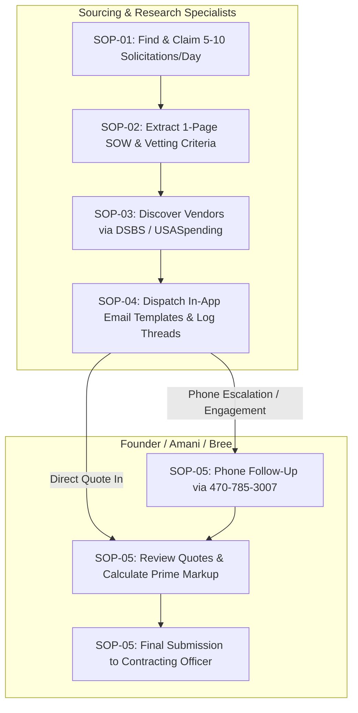

# Standard Operating Procedures (SOPs) — GovCon Sourcing & Subcontractor Engine

> **Operational Hub:** Justice Quest LLC (dba Gov Services Connect)  
> **Office Line:** (470) 785-3007 | **Email:** admin@govservicesconnect.com  
> **CAGE:** 21GM9 | **UEI:** MU8FAL4JBL91  

---

## SOP Directory & Quick Links

| Document | Title | Primary Role | Key Outcome |
| :--- | :--- | :--- | :--- |
| [**SOP-01**](./SOP-01-Daily-Solicitation-Discovery.md) | **Daily Solicitation Discovery & Claiming Protocol** | Sourcing Specialists | 5–10 Qualified Solicitations per agent/day claimed without collision. |
| [**SOP-02**](./SOP-02-Solicitation-Deconstruction.md) | **Solicitation Deconstruction & Sourcing Packet Generation** | Sourcing / Extraction | 1-page plain-English SOW, qualifications, and 3–5 vetting questions. |
| [**SOP-03**](./SOP-03-Vendor-Search-Protocol.md) | **Multi-Channel Vendor Search & Discovery Protocol** | Sourcing Specialists | 5–8 Qualified vendor contacts sourced via DSBS, USASpending, GSA. |
| [**SOP-04**](./SOP-04-Vendor-Outreach-Protocol.md) | **Vendor Email Outreach, Response Logging & System Tracking** | Outreach Agents | In-app template dispatch, status tracking, and thread history management. |
| [**SOP-05**](./SOP-05-US-Escalation-and-Quote-Intake.md) | **US Team Phone Escalation, Quote Intake & Submission Handoff** | US Operations Team | Phone closes, quote intake, prime markup, and bid submission to CO. |
| [**SOP-06**](./SOP-06-Triage-Pipeline-Failures-and-Recovery.md) | **Triage Pipeline Failures, Bottleneck Prevention & Rapid Recovery Protocol** | Operations / Sourcing | Smart Ingest (ZIP upload), 60-second recovery, and triage diagnostic tooling. |

---

## Operational Workflow Overview

