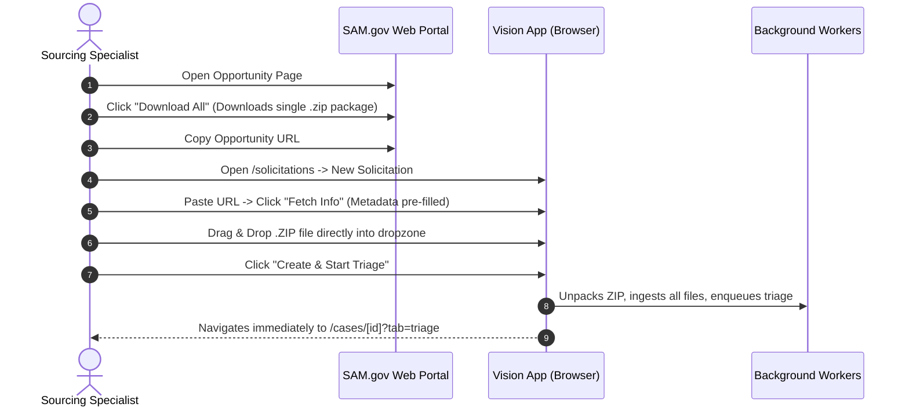

# SOP-06: Solicitation Triage Failures, Bottleneck Prevention & Rapid Recovery Protocol

> **Operational Hub:** Justice Quest LLC (dba Gov Services Connect)  
> **Office Line:** (470) 785-3007 | **Email:** admin@govservicesconnect.com  
> **CAGE:** 21GM9 | **UEI:** MU8FAL4JBL91  

---

## 1. Objective & Purpose

The execution team (sourcing specialists, phone agents, and proposal writers) depends critically on three programmatic outputs before picking up the phone to call subcontractor vendors:
1. **Sourcing Script** (what to ask/say to prospective subcontractors on phone calls)
2. **Submission Checklist** (deadlines, delivery email/addresses, bonding, compliance gates)
3. **Statement of Work (SOW)** (technical scope, wage determinations, CLINs, licensing)

When high volumes of solicitations are processed simultaneously, relying on SAM.gov's attachment download API introduces severe rate-limiting (`429 Too Many Requests`), network timeouts, and missing attachments. 

This SOP outlines:
1. **The Primary Workflow:** How to ingest packages directly via **Smart Ingest (ZIP / Document Upload)** to 100% bypass SAM.gov attachment download bottlenecks.
2. **The 60-Second Diagnostic Protocol:** How to pinpoint why a triage run stalled or failed.
3. **The Rapid Recovery SOP:** Step-by-step corrective actions to recover and re-triage any solicitation in under 2 minutes.

---

## 2. The Primary Intake Protocol: Smart Ingest (ZIP Upload)

To guarantee zero attachment download throttling from SAM.gov, all sourcing team members must follow this standard intake protocol:



### Steps to Ingest:
1. **On SAM.gov:**
   - Locate the solicitation.
   - Under the **Attachments/Links** section, click **"Download All"**. This saves a single `.zip` file (e.g., `Attachments_W9127824B0001.zip`) to your computer.
   - Copy the SAM.gov Opportunity URL from your browser address bar.
2. **In Vision:**
   - Navigate to `/solicitations` (the main dashboard).
   - In the **New Solicitation** card, paste the SAM.gov URL into the URL field and click **"Fetch Info"**.
   - Notice that Title, Agency, NAICS, Set-Aside, and Response Deadline are immediately pre-fetched.
   - Drag and drop the downloaded `.zip` file directly into the **Dropzone** (or select individual PDF/DOCX/XLSX/TXT files).
   - Click **"Create & Start Triage"**.
3. **Outcome:**
   - Vision uploads the package, extracts all files (safely filtering out system junk like `__MACOSX`), uploads the original binaries to storage, parses text/blocks, and launches triage immediately.
   - You are routed straight to the Case Triage tab where you can monitor extraction live.

---

## 3. Failure Modes & Rapid Diagnostics

If a triage pipeline encounters an issue, follow this 3-step diagnostic checklist:

### Diagnostic Checklist

| Step | Check | Healthy State | Warning / Failure Action |
| :--- | :--- | :--- | :--- |
| **1** | **Ingestion Status** | `complete` | If `fetching` or `pending` for > 3 minutes: SAM.gov API is rate-limiting downloads. Follow **Recovery Protocol A** below. |
| **2** | **Attached Documents** | > 0 documents | If 0 documents attached, the agent cannot extract artifacts. Follow **Recovery Protocol B**. |
| **3** | **Triage Status** | `complete` | If `failed` or stuck on `running`: run CLI diagnostic or in-app retry. Follow **Recovery Protocol C**. |

---

## 4. Rapid Recovery Protocols

### Protocol A: SAM.gov Rate-Limit Bypass (Under 60 Seconds)
If an old or automated solicitation is stuck in `fetching` status due to SAM.gov API rate limits:
1. Open the solicitation link on SAM.gov in your browser.
2. Download the attachments `.zip` file to your computer.
3. Open the solicitation in Vision, switch to the **Documents** tab.
4. Click **"Upload Document"** and upload the `.zip` or individual PDF files.
5. Once uploaded, click **"Run Triage"** on the triage tab.

### Protocol B: Unrecognized or Corrupted Document Format
Vision's ingestion engine supports `.pdf`, `.docx`, `.doc`, `.xlsx`, `.csv`, `.txt`, and `.md`.
If a contracting office uploaded an unusual file format (e.g., password-protected PDF or obscure CAD drawings):
1. Check the Documents list in Vision.
2. If a document shows `OCR: failed`, open the file on your local machine.
3. Save or export it as a standard PDF or TXT file.
4. Upload the clean version to the **Documents** tab and re-run triage.

### Protocol C: Automated Recovery via Terminal (For Operations Leads)
Operations leads can inspect and re-trigger any triage job instantly using the diagnostic tool:

```bash
# 1. Check a specific solicitation
python backend/scripts/diagnose_triage.py --solicitation <ID>

# 2. Check by Case ID
python backend/scripts/diagnose_triage.py --case <CASE_ID>

# 3. List all failed or stalled jobs across the entire company
python backend/scripts/diagnose_triage.py --list-failed

# 4. Instant one-line triage retry (resets status and queues worker immediately)
python backend/scripts/diagnose_triage.py --retry <SOLICITATION_ID>
```

---

## 5. Escalation & Quality Verification

Before handing off the triage artifacts to phone agents:
1. Verify the **Sourcing Script** contains the correct NAICS code and target subcontracting scope.
2. Verify the **Submission Checklist** highlights mandatory certifications (e.g. OSHA 30, state general contractor license) and the exact submission email/deadline.
3. If an amendment (e.g. `Amend_0001.pdf` or `Q&A.pdf`) is later posted to SAM.gov, upload the amendment to the Documents tab and re-run triage so the artifacts reflect the latest Contracting Officer guidance.
