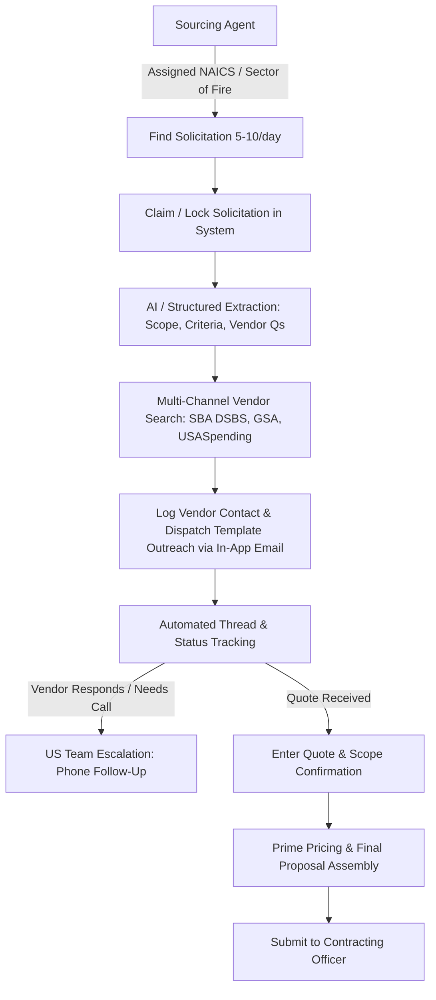

# GovCon Sourcing & Subcontractor Outreach Engine — Plan of Action

> **Source Analysis:** Synthesized from `/Users/ianbruce/code/vision/scratch.md` (operator voice transcript & workflow blueprint) and cross-referenced with existing infrastructure (`backend/api/routes/subcontracting_leads.py`, `quotes.py`, `correspondence.py`, and `frontend/src/app/`).

---

## 1. Executive Summary & Core Objective

The business operates as a **prime contractor aggregator/doorway** into federal, state, and local contracting. To operate without the founder being the bottleneck, a distributed sourcing team (e.g., Pakistan-based research & outreach agents + US-based closing & technical follow-up) must systematically:
1. **Find 5–10 relevant bids per day per agent** without overlapping ("sectors of fire").
2. **Deconstruct the solicitation** into structured sourcing criteria (Scope of Work, mandatory qualifications, past performance requirements, and vendor vetting questions).
3. **Source qualified subcontractors & vendors** through multiple government databases and registries.
4. **Conduct standardized email outreach and thread logging** directly through an internal application.
5. **Route phone touchpoints & quote intake** to US-based coordinators/founder.
6. **Capture quotes and assemble submission packets** for final approval and submission to the Contracting Officer (CO).

---

## 2. End-to-End Workflow Architecture



---

## 3. Detailed Operational Phases & Requirements

### Phase 1: Solicitation Discovery & Conflict Prevention ("Sectors of Fire")
* **The Problem:** 3+ agents searching for bids can step on each other, waste effort duplicate-bidding, or leave high-margin sectors uncovered.
* **The Solution:**
  * **Assigned Sectors:** Assign explicit NAICS families and service types per operator (e.g., Operator 1: Construction & Facilities / 236220, 238220; Operator 2: IT & Technology Services / 541511, 541519; Operator 3: Environmental / Pest Control / Support Services / 561710, 561210).
  * **Claiming & Locking Mechanism:** When an agent identifies a solicitation on SAM.gov, DIBBS, or state portals, they enter the Notice ID / Solicitation Number. If already claimed by another agent, the system warns and blocks duplicate effort.
  * **Daily Quota Dashboard:** Live scoreboard tracking: Bids Found (target: 5–10/agent/day), Solicitations Claimed, Outreach Emails Dispatched, Quotes Received.

### Phase 2: Solicitation Deconstruction & Sourcing Brief
* **The Problem:** Sourcing agents cannot blindly send 80-page RFPs to subcontractors; vendors will ignore them.
* **The Solution:** A 1-page standardized "Sourcing Packet" generated per solicitation containing:
  1. **Plain-English SOW:** Summary of work to be performed.
  2. **Location & Period of Performance:** Exact base/facility and timeline.
  3. **Mandatory Qualifications:** Certifications, licenses (e.g., Master Electrician, EPA Universal), bonding minimums, clearance level.
  4. **Subcontractor Past Performance Threshold:** Required number of similar contracts or years in business.
  5. **Vendor Discovery Script / Questions:** 3–5 exact questions the sourcing agent asks the vendor to qualify them immediately.

### Phase 3: Multi-Source Vendor Discovery Protocol
* **The Problem:** Relying only on Google leads to paralyzed research agents and unvetted contractors with no federal experience.
* **The Solution:** A documented, tiered sourcing matrix:
  1. **Tier 1 — SBA Dynamic Small Business Search (DSBS / SBS):** Query by NAICS, state/radius, and socio-economic set-aside (SDVOSB, HUBZone, WOSB, 8a). Provides verified active small businesses.
  2. **Tier 2 — USASpending.gov & Subcontracting Leads:** Query recent subcontractors and awardees in the target NAICS/PSC.
  3. **Tier 3 — GSA eLibrary & Contract Holders:** Find vendors already vetted on GSA Schedules looking for partnering opportunities.
  4. **Tier 4 — Local Trade Associations & State Licensing Boards:** For localized construction/facilities trades.

### Phase 4: Centralized In-App Outreach & Thread Management
* **The Problem:** Managing outreach in disconnected personal inboxes or scattered spreadsheets causes lost leads, zero institutional record, and messy handoffs.
* **The Solution:**
  * **In-App Email Dispatch:** The sourcing agent clicks "Outreach Vendor" inside the solicitation view. An outreach template pre-populates with the vendor's name, plain-English SOW, deadline for quote, and questions.
  * **Vendor Mini-Profile Creation:** As part of dispatch, the agent logs: Business Name, Contact Person, Email, Phone, Website, UEI/CAGE (if known).
  * **Thread & Status Tracking:** Connects to the existing correspondence backend (`/api/correspondence` and Mailgun webhooks).
  * **Status Pipeline:** `Identified` → `Email Sent` → `Follow-up Required` → `Call Scheduled (US Team)` → `Quote Received` → `Declined / Non-Responsive`.

### Phase 5: Team Division of Labor (Offshore vs. US Execution)
* **Offshore Sourcing Team (Pakistan):**
  * Find and claim solicitations against quota.
  * Run vendor search and extract contacts.
  * Send standard cold outreach emails via the internal portal.
  * Log incoming written replies and alert US team.
* **US Coordination Team (Founder / Amani / Bree):**
  * Conduct phone follow-ups with responsive vendors.
  * Clarify technical pricing, site visits, or bonding.
  * Review subcontractor quotes and finalize markups.
  * Complete SF-1449 / standard forms and submit bid to the agency.

---

## 4. Software Implementation Plan (Feature Roadmap)

```
┌────────────────────────────────────────────────────────────────────────┐
│                        GOVCON SOURCING PLATFORM                        │
├───────────────────────────────────┬────────────────────────────────────┤
│ 1. SOLICITATION TRIAGE & CLAIMING │ 2. SOURCING PACKET GENERATOR       │
│ • Daily quota tracker (5-10/day)  │ • AI / Rule-based SOW summary      │
│ • Duplicate lock / Claim button   │ • Mandatory vendor qualifications  │
│ • NAICS & Sector-of-fire filters  │ • 3-5 tailored vetting questions   │
├───────────────────────────────────┼────────────────────────────────────┤
│ 3. VENDOR OUTREACH MODAL & LOG    │ 4. CORRESPONDENCE & PHONE QUEUE   │
│ • 1-click template email sender   │ • Mailgun inbound/outbound sync    │
│ • Auto-log vendor profile & CAGE  │ • "Needs US Phone Call" queue      │
│ • Unified vendor history          │ • Quote entry & margin calculator  │
└───────────────────────────────────┴────────────────────────────────────┘
```

### Milestone 1: Sector-of-Fire Claiming & Solicitation Queue
- **DB:** Add `claimed_by_user_id`, `claimed_at`, `sourcing_status` to solicitations schema.
- **API:** Endpoints for `POST /api/solicitations/{id}/claim` and `GET /api/solicitations/my-queue`.
- **UI:** Daily quota widget ("Your Daily Bids: 6/10") + "Claim Solicitation" action with duplicate collision warning.

### Milestone 2: Sourcing Packet & Vendor Vetting Specs
- **Data Model:** Store structured Sourcing Packet (`sow_summary`, `required_certs`, `qualification_criteria`, `vetting_questions`).
- **UI:** "Sourcing Brief" tab on the solicitation page so agents see exact copy-paste talking points.

### Milestone 3: In-App Vendor Outreach & Logging Modal
- **Data Model:** Link `vendor_profiles` to `solicitation_matches` and `correspondence_threads`.
- **UI:** "New Vendor Outreach" modal in frontend:
  - Input: Company name, Contact name, Email, Phone, Website.
  - Template dropdown: Initial SOW Request, Follow-up, Scope Clarification.
  - One-click Send via backend API.

### Milestone 4: Escalation Queue & Quote Submission Handoff
- **UI & Alerts:** "US Call Escalation" list for leads where phone follow-up is needed.
- **Quote Intake:** Leverage existing `core/quote.py` and `quotes.py` routes with clean frontend UI for entering quotes ($ amount, attachments, scope notes) and calculating prime margin.

---

## 5. Standard Operating Procedures (SOP) to Author Next

To make this immediately actionable for the team, the following SOP documents will be drafted in `docs/sops/`:
1. **`SOP-01-Daily-Solicitation-Discovery.md`**: How to find 5–10 bids per day within assigned NAICS sectors.
2. **`SOP-02-Vendor-Database-Lookup.md`**: Step-by-step search tactics for SBA DSBS, GSA eLibrary, and USASpending.
3. **`SOP-03-Vendor-Outreach-Email-Templates.md`**: High-conversion outreach scripts that contractors actually respond to.
4. **`SOP-04-Quote-Intake-and-US-Handoff.md`**: How to log received quotes and hand off for final pricing.
